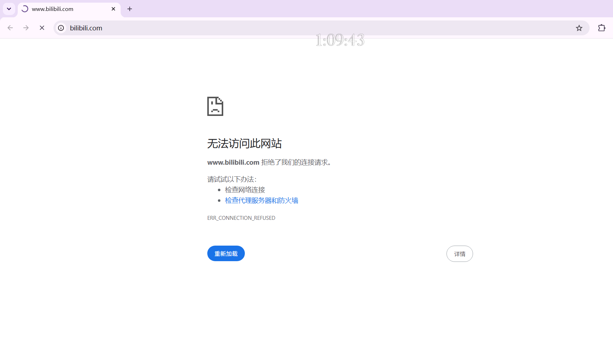

<p align="center">
  
  <h1 align="center">Focus Tool</h1>
  <p align="center">一个让你真正专注工作的 Windows 桌面小工具：置顶倒计时悬浮窗 + 自动屏蔽知乎、哔哩哔哩</p>
  <p align="center">
    <b>中文</b> | <a href="README.en.md">English</a>
  </p>
</p>

<p align="center">
  
  
  
  <a href="https://github.com/Cpuritan/Focus-Tool/releases"></a>
</p>

---

## 🖼 效果预览



> 专注期间：屏幕上方显示半透明倒计时数字，浏览器中知乎、哔哩哔哩无法访问，任务栏中也没有可以随手关闭的窗口。

---

## ✨ 功能特性

- **置顶倒计时悬浮窗**：半透明、可穿透点击的倒计时数字悬浮在屏幕上方，随时可见但不遮挡操作
- **自动屏蔽分心网站**：运行期间通过修改 `hosts` 文件屏蔽知乎、哔哩哔哩等网站，结束后自动恢复
- **退出摩擦设计**（刻意为之）：
  - 悬浮窗**不显示在任务栏**，也不会出现在 Alt+Tab 切换列表中
  - 任务栏"关闭窗口"、`Alt+F4` 全部无效
  - **只能通过任务管理器结束进程**才能中途退出 —— 帮你在专注时"走不出门"
- **看门狗保护**：即使进程被强制结束，独立的看门狗进程也会立即自动恢复 `hosts` 文件
- **单实例运行**：重复启动会提示已在运行，不会开多个倒计时
- **灵活的时间输入**：支持 `25`（分钟）、`1h30m`、`1:30:00` 等多种格式，最长 360 分钟
- **优雅退出**：正常倒计时结束自动恢复网络；关机/注销时也会自动清理 `hosts`

## 📥 下载与使用

### 下载

从 [Releases](https://github.com/Cpuritan/Focus-Tool/releases) 下载最新的 `FocusTool.exe`，无需安装，双击即用。

### 使用步骤

1. 双击运行 `FocusTool.exe`
2. 首次运行会弹出 **UAC 提权提示**（修改 `hosts` 文件需要管理员权限），点击「是」
3. 输入专注时长（分钟，最多 360），点击「开始」
4. 专注期间屏幕上方出现倒计时悬浮窗，知乎、哔哩哔哩被屏蔽
5. 倒计时结束自动退出，网站访问恢复

### 如何退出 / 结束专注

| 场景 | 方式 |
| --- | --- |
| 正常结束 | 倒计时走完，自动退出并恢复网站 |
| 中途强制退出 | 打开**任务管理器** → 找到「FocusTool.exe」→ 结束任务（hosts 会自动恢复） |
| 手动恢复网站 | 以管理员身份运行 `FocusTool.exe --restore` |

> ⚠️ **请知悉**：中途无法通过任务栏或 `Alt+F4` 关闭，这是刻意设计的"退出摩擦"，目的是帮助你坚持完成专注。关闭前请想清楚是否真的需要打断自己。

## 🔧 工作原理

1. **倒计时悬浮窗**：使用 Win32 API 创建无边框、置顶、可穿透点击的分层窗口（`WS_EX_LAYERED | WS_EX_TRANSPARENT | WS_EX_TOPMOST | WS_EX_TOOLWINDOW`），实时渲染倒计时数字
2. **网站屏蔽**：在 `C:\Windows\System32\drivers\etc\hosts` 中添加由标记 `# >>> FocusTool managed block >>>` 包裹的托管块，将知乎、哔哩哔哩相关域名指向 `0.0.0.0` 和 `::1`，并刷新 DNS
3. **看门狗**：启动时派生一个独立的看门狗进程监视主进程；主进程无论因何结束（含被强制结束），看门狗都会确保 `hosts` 被恢复

## 🛠 从源码构建

**环境要求**：Python 3.11+、Windows 10/11

```bash
pip install pyinstaller pillow
pyinstaller focus_tool.spec --noconfirm
```

构建产物位于 `dist/FocusTool.exe`。

### 目录结构

```
├── focus_tool.py          # 主程序（全部逻辑）
├── focus_tool.spec        # PyInstaller 打包配置
├── study_cat_icon.ico     # 程序图标
├── README.md              # 中文说明
└── README.en.md           # English documentation
```

## ❓ 常见问题

**Q: 为什么运行时要管理员权限？**
修改 `hosts` 文件需要管理员权限，这是系统安全机制。

**Q: 屏蔽了哪些网站？**
内置域名列表包含知乎（zhihu.com、zhimg.com 等）和哔哩哔哩（bilibili.com、b23.tv、bilivideo.com 等）的全系列域名。

**Q: 强制结束后 hosts 没恢复怎么办？**
一般看门狗会在数秒内自动恢复。若仍未恢复，以管理员身份运行 `FocusTool.exe --restore` 手动恢复。

**Q: 悬浮窗能点击吗？**
不能。悬浮窗设置了点击穿透（`WS_EX_TRANSPARENT`），完全不影响你操作其他程序。

## 📄 许可证

[MIT](LICENSE) © Cpuritan
